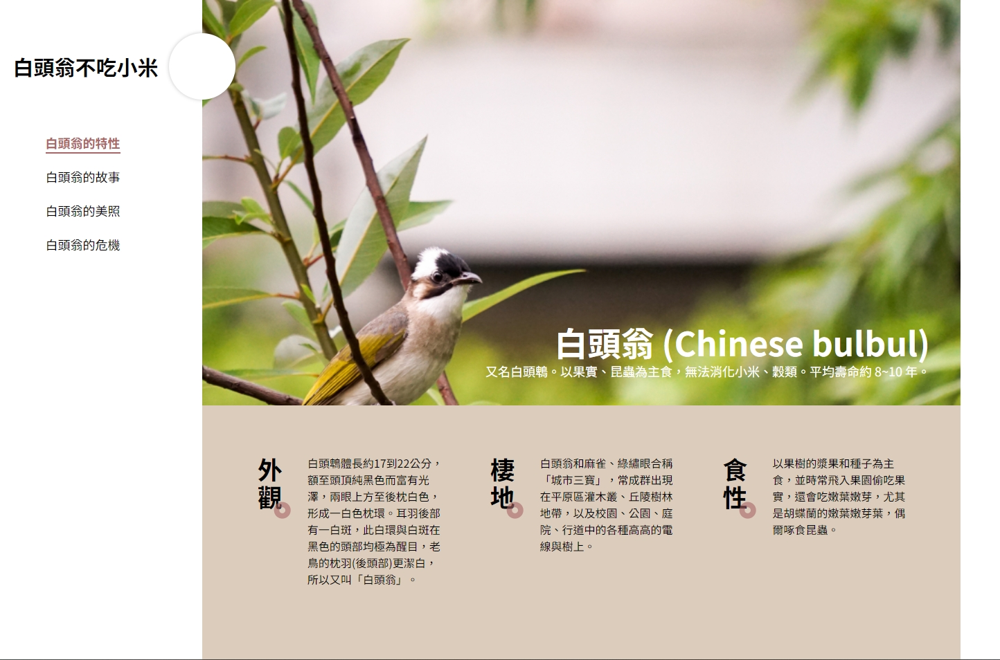
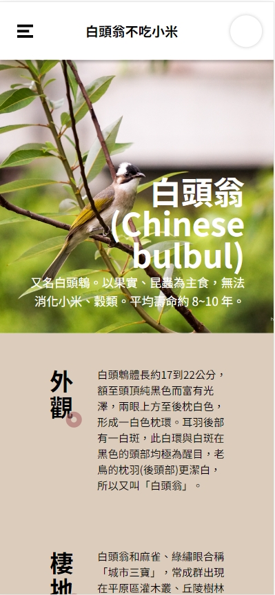

<h1 align="center">2023 Cross Night Furry</h1>

  
  
  
  

<h2>
<a href="https://side-project-web-layout.vercel.app/">
 demo here
</a>
</h2>

## 📄 Description

This project uses Vite as the build tool, Vue3 as the front-end framework, and TailwindCSS as the CSS framework to create a simple web layout. Through this project, developers can learn how to use Vue3 and TailwindCSS to quickly build web layout.

## 🚀 Features

- The page is developed with Vue.js framework.
- The page is use Tailwind CSS framework.
- Build tool use Vite.
- There is no database required.

## 📦 Setup & Development Server

1. Run `npm i` or `npm install` to install the Node.js dependencies.
2. Run `npm run dev` to run server. Server is listening on localhost:3000.
3. Open `http://localhost:5173/` in your browser.

